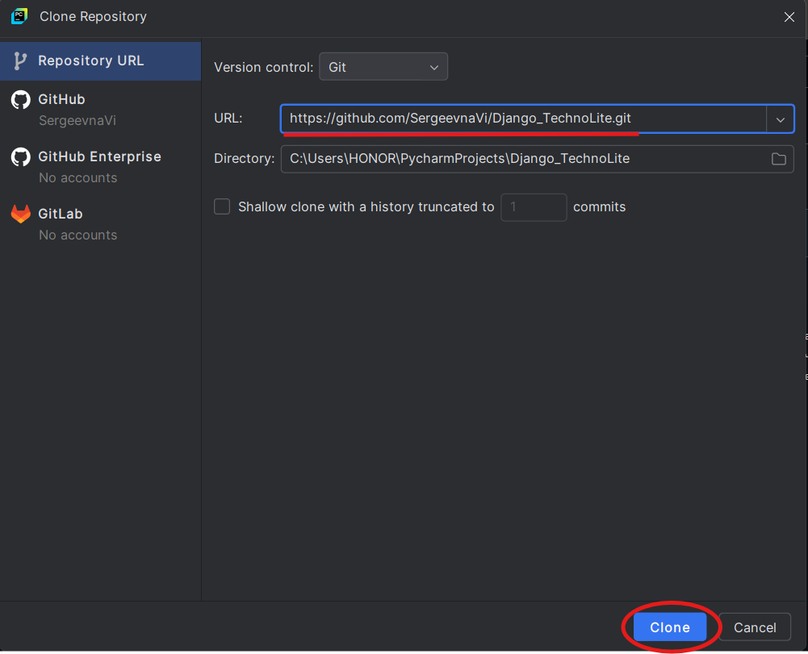

# TechnoLite

Проект основан на разработке веб-приложения для онлайн-магазина бытовой техники. Он предназначен для упрощения процесса покупки различной бытовой техники, такой как телевизоры, смартфоны, холодильники и другие устройства. Основная цель проекта - создать удобную и практичную платформу, на которой пользователи смогут легко находить нужные товары, добавлять их в корзину покупок и оформлять заказы с выбором способов оплаты и доставки.

## Содержание
  [Функции проекта](#функции-проекта)  
  [Задачи](#задачи)  
  [Технологии](#технологии)  
  [Проблемы и улучшения в будущем](#проблемы-и-улучшения-в-будущем)  
  [Установка и запуск проекта](#установка-и-запуск-проекта)  
  [Инструкция по использованию проекта](#инструкция-по-использованию-проекта)  
  [Вывод](#вывод)  
  [Источники](#источники)  

 
## Функции проекта

1. **Регистрация и авторизация пользователя**
   
   Пользователи могут создать учетную запись или воспользоваться входом через Google, чтобы получить доступ к персонализированным данным, включая историю заказов, личную информацию и статус заказов.

2. **Просмотр товаров**
   
   Каталог товаров оснащен фильтрами для удобного и быстрого поиска. Каждая карточка товара предоставляет подробную информацию: описание, характеристики, изображение и цену.

3. **Корзина и оформление заказов**
   
   Позволяет добавлять товары, выбирать способ оплаты (наличными, картой при получении или онлайн) и указывать адрес доставки. Оформление заказов интуитивно и быстро.

4. **Обработка заказов**
   
   Заказы обрабатываются в реальном времени. После оформления заказа товар автоматически списывается с наличия на складе, а пользователи получают уведомления о текущем статусе заказа.

5. **Безопасность и защита данных**
   
   Для защиты пользовательских данных используется хеширование паролей и безопасное подключение к базе данных. Все конфиденциальные данные передаются по защищенному каналу.


## Задачи

- Предоставить пользователям удобный интерфейс для выбора и покупки бытовой техники.
- Создать учетные записи для пользователей с возможностью отслеживания истории заказов и личной информации.
- Автоматизировать обновление наличия товаров на складе и уведомление о статусе заказа.
- Обеспечить защиту данных с использованием хеширования паролей и безопасного подключения к базе данных.
- Реализовать фильтры для быстрого поиска товаров по различным параметрам, а также добавить поисковую строку.

## Технологии
  
  
  
  
  
  
  
  
  
  

Проект использует современные технологии для создания функционального веб-приложения.

- _**Python**_ используется как основной язык для серверной логики.  
- _**Django**_ является фреймворком для создания веб-приложений и работы с базой данных через ORM.
- _**jQuery**_ используется для обработки событий и выполнения асинхронных запросов (AJAX) без перезагрузки страницы.
- _**PostgreSQL**_ служит системой управления базами данных для хранения данных о пользователях и товарах.  
- _**JavaScript**_ отвечает за динамичные элементы страницы, такие как фильтрация товаров.  
- _**HTML5**_ и _**CSS3**_ используются для создания структуры и стилизации интерфейса.  
- _**Bootstrap**_ помогает создавать адаптивный и современный интерфейс.  
- _**Git**_ обеспечивает контроль версий.  
- _**PyCharm**_ служит удобной средой разработки для Python.


## Проблемы и улучшения в будущем

На данный момент проект полностью функционален, но в будущем планируется реализовать дополнительные возможности:

- **Добавление отзывов и рейтингов для товаров.** Позволит пользователям оставлять отзывы и оценивать товары, что поможет другим покупателям в принятии решения.
- **Расширенные возможности поиска.** Добавление фильтров и параметров для поиска товаров (по бренду, рейтингу, цене и т. д.), что улучшит пользовательский опыт.
- **Авторизация через Google.** Реализация системы авторизации через Google, чтобы пользователи могли быстрее и удобнее входить в систему с помощью своих Google-аккаунтов.
- **Восстановление пароля.** Временно отсутствует возможность восстановления пароля, но в будущем будет добавлена функциональность для восстановления пароля через email для пользователей, забывших свои учетные данные.


## Установка и запуск проекта

#### 1. Клонирование репозитория

Выполните команду в git bash/терминале
```
git clone https://github.com/SergeevnaVi/Django_TechnoLite.git
```

Или через PyCharm
<details>
  <summary>Нажмите, чтобы увидеть картинку</summary>
  
</details>


#### 2. В корневой директории проекта создайте виртуальное окружение
```
python -m venv venv
```

Активируйте виртуальное окружение:
   - Для Windows:  
     ```venv\Scripts\activate```
  - Для macOS/Linux:  
    ```source venv/bin/activate```

#### 3. Установите все зависимости, указанные в файле requirements.txt:
```
pip install -r requirements.txt
```

#### 4. Настройка PostgreSQL
  
  1. Установите ```PostgreSQL``` и настройте сервер через pgAdmin 4:  
    - Создайте нового пользователя (например, root) с паролем.
    - Создайте базу данных для проекта.
  
  2. Настройте подключение к PostgreSQL в файле ```settings.py```:
     ```
     DATABASES = {
       'default': {
        'ENGINE': 'django.db.backends.postgresql',
        'NAME': 'your_database_name',
        'USER': 'your_username',
        'PASSWORD': 'your_password',
        'HOST': 'localhost',
        'PORT': '5432',
       }
     }
     ```

#### 5. Создайте структуру базы данных с помощью миграций:
```
python manage.py migrate
```

#### 6. Создайте суперпользователя для админ-панели:
```
python manage.py createsuperuser
```

#### 7. Загрузите данные из файлов ```.json```:
```
python manage.py loaddata fixtures/products/categories.json
python manage.py loaddata fixtures/products/products.json
```

#### 8. Запустите сервер:
```
python manage.py runserver
```

Приложение будет доступно по адресу: ```http://127.0.0.1:8000```


## Инструкция по использованию проекта

Этот раздел поможет вам правильно использовать проект, взаимодействовать с веб-приложением и решать возможные проблемы. Приведены инструкции, примеры действий и описание функционала.

#### 1. Описание функционала сайта
Проект представляет собой веб-приложение для магазина бытовой техники, где пользователи могут:

- Просматривать все товары в каталоге, фильтровать их по категориям и сортировать по цене, рейтингу или популярности.
- При просмотре товара добавить его в корзину для последующего оформления заказа.
- После добавления товаров в корзину перейти к оформлению заказа, где указывает свои данные для доставки и способ оплаты.
- Зарегистрировать аккаунт и управлять своими данными, просматривать историю заказов и управлять своей корзиной.

---
#### 2. Регистрация и авторизация
Для того чтобы начать использовать приложение, выполните следующие шаги:
1. Перейдите на страницу "Авторизации". Для этого нажмите на кнопку "Войти" в верхней панели страницы.
2. На странице авторизации будет форма для входа в систему. Для регистрации нажмите на ссылку "Создать аккаунт", которая находится под формой для ввода данных.
3. Заполните форму с личными данными:

    - Имя: Ваше имя.
    - Фамилия: Ваша фамилия.
    - Имя пользователя: Ваше имя пользователя.
    - Адрес электронной почты: Укажите e-mail адрес.
    - Пароль: Придумайте надежный пароль и подтвердите его.


4. После того как вы заполнили все поля, нажмите кнопку Зарегистрироваться.

---
#### 3. Просмотр товаров
После успешной авторизации, вы попадете на главную страницу каталога товаров.


1. На главной странице вам будут представлены товары, разделенные по категориям (например, все товары, телевизоры, техника для дома, техника для кухни и другие).

2. Вы можете фильтровать товары по категориям или сортировать их по различным параметрам:

    - По цене (от дешевых к дорогим или наоборот).
    - По скидке (только товары по скидке).
    
3. При необходимости, вы можете открыть страницу товара по ссылке, чтобы узнать более подробную информацию о нем (описание, характеристики, фото, цена).

Пример экрана с товарами:  


---
#### 4. Добавление товара в корзину
Если вам понравился товар, и вы хотите добавить его в корзину, выполните следующие шаги:

1. Перейдите на страницу товара, который хотите купить.

2. На странице товара будет кнопка "Добавить в корзину". Нажмите на нее.

3. После этого откроется всплывающее окно или появится сообщение, подтверждающее, что товар успешно добавлен в корзину. Если это окно не появляется, проверьте, добавлен ли товар в корзину через иконку корзины на главной странице или в меню.

Пример экрана с корзиной:  


---
#### 5. Оформление заказа
Когда вы добавите все товары, которые хотите купить, в корзину, переходите к оформлению заказа.

1. Перейдите в раздел "Корзина".

2. Проверьте, что все товары, которые вы хотите купить, добавлены в корзину.

3. Если все верно, нажмите кнопку "Оформить заказ".

4. На следующем шаге вам будет предложено ввести данные для доставки:

    - Имя: Ваше имя
    - Фамилия: Ваша фамилия
    - Номер телефона: Ваш номер телефона
    - Выберите способ доставки: Нужна доставка или Самовывоз.
    - Адрес доставки: Если вам нужна доствка, то введите адрес доставки, на который должен быть доставлен товар. Если не нужна доставка, то выбирайте "Самовывоз".
    - Способ оплаты: выберите, как вы хотите оплатить заказ (картой/наличными при получении или картой онлайн).
    
5. После проверки всех данных и выбора способа оплаты, подтвердите заказ.

Пример экрана оформления заказа:  


---
#### 6. Админ-панель
Для того чтобы войти в админ-панель, вам нужно быть авторизованным суперпользователем (администратором).

1. Перейдите по адресу ```http://127.0.0.1:8000/admin```.

2. Введите логин и пароль суперпользователя, который был создан при настройке проекта.

   Пример данных для входа в админ-панель:
      - Логин: admin
      - Пароль: admin123

3. Что можно делать в админ-панели:

    - Управлять товарами (добавлять новые товары, редактировать существующие, удалять).
    - Просматривать и управлять заказами пользователей.
    - Управлять данными пользователей (например, изменять их информацию или блокировать учетные записи).

Пример экрана админ-панели:  


---
#### 7. Примеры кода
Для разработчиков, работающих с кодом, предоставлены примеры реализации моделей и логики.

***Пример модели товара (файл models.py):***
```
class Products(models.Model):
    name = models.CharField(max_length=150, unique=True, verbose_name='Название')
    manufacturer = models.CharField(max_length=55, blank=True, null=True, verbose_name='Производитель')
    slug = models.SlugField(max_length=200, unique=True, blank=True, null=True, verbose_name='URL')
    description = models.TextField(blank=True, null=True, verbose_name='Описание')
    image = models.ImageField(upload_to='products_images', blank=True, null=True, verbose_name='Изображение')
    price = models.DecimalField(default=0.00, max_digits=9, decimal_places=2, verbose_name='Цена')
    discount = models.DecimalField(default=0.00, max_digits=7, decimal_places=2, verbose_name='Скидка в %')
    quantity = models.PositiveIntegerField(default=0, verbose_name='Количество')
    category = models.ForeignKey(to=Categories, on_delete=models.PROTECT, verbose_name='Категория')

    class Meta:
        db_table = 'product'
        verbose_name = 'Товар'
        verbose_name_plural = 'Товары'
        ordering = ('id',)

    def __str__(self):
        return f'{self.name}. Количество - {self.quantity}'
```

Модель Products описывает товар в магазине, включая его название, производителя, описание, изображение, цену, скидку, количество на складе и категорию. Каждый товар связан с категорией через внешний ключ. Поля включают информацию о товаре (например, название и описание), а также функциональные поля, такие как цена, скидка и количество. Модель используется для хранения и отображения информации о товарах в базе данных.


***Пример модели заказов (файл models.py):***
```
class Order(models.Model):
    user = models.ForeignKey(to=User, on_delete=models.SET_DEFAULT, blank=True, null=True,
                             verbose_name="Пользователь", default=None)
    created_timestamp = models.DateTimeField(auto_now_add=True, verbose_name="Дата создания заказа")
    phone_number = models.CharField(max_length=10, verbose_name="Номер телефона")
    requires_delivery = models.BooleanField(default=False, verbose_name="Требуется доставка")
    delivery_address = models.TextField(null=True, blank=True, verbose_name="Адрес доставки")
    payment_on_get = models.BooleanField(default=False, verbose_name="Оплата при получении")
    is_paid = models.BooleanField(default=False, verbose_name="Оплачено")
    status = models.CharField(max_length=50, default='В обработке', verbose_name="Статус заказа")

    class Meta:
        db_table = "order"
        verbose_name = "Заказ"
        verbose_name_plural = "Заказы"

    def __str__(self):
        return f"Заказ № {self.pk} | Покупатель {self.user.first_name} {self.user.last_name}"
```

Модель Order хранит информацию о заказах, оформленных пользователями. Она включает ссылку на пользователя, сделавшего заказ, дату и время создания заказа, контактный номер телефона пользователя, флаг, указывающий на необходимость доставки, а также адрес доставки, если доставка требуется. Также в модели содержатся флаги, определяющие способ оплаты (при получении) и подтверждение оплаты. Статус заказа отображает его текущее состояние, например, "В обработке", "Отправлен" или "Доставлен".

---
#### 8. Структура проекта
Проект состоит из нескольких важных компонентов, каждый из которых выполняет свою задачу:

1. Модели (models): Это классы, которые определяют структуру базы данных.
2. Контроллеры (views): Они обрабатывают запросы пользователя и подготавливают данные для отображения на страницах.
3. Шаблоны (templates): Это HTML-шаблоны, которые определяют внешний вид страниц сайта.
4. Статические файлы (static): Включают изображения, стили CSS и JavaScript файлы, которые используются для визуального оформления сайта.

Пример структуры проекта:
```
./
    carts/
        migrations/
        templates/
            carts/
                includes/
        templatetags/
    fixtures/
        products/
    main/
        migrations/
        templates/
            main/
    media/
        users_images/
    orders/
        migrations/
        templates/
            orders/
    products/
        migrations/
        templates/
            products/
        templatetags/
    readme_assets/
    static/
        deps/
            css/
                bootstrap/
            favicon/
            icon/
            images/
            js/
                bootstrap/
                jquery/
    TechnoLite/
    templates/
        includes/
    users/
        migrations/
        templates/
            users/

```

Проект состоит из нескольких ключевых компонентов, которые взаимодействуют для функционирования интернет-магазина. Основное приложение управляет отображением товаров, корзины и оформлением заказов. Каждое отдельное приложение отвечает за конкретный функционал, включая работу с пользователями, обработку заказов и товары. Также предусмотрены конфигурационные файлы для настройки базы данных, путей к статическим файлам и шаблонам, а также других параметров для нормальной работы приложения.


---
#### 9. Решение проблем
Если возникнут проблемы с запуском проекта или его функциональностью, выполните следующие шаги:

1. Убедитесь, что все зависимости установлены. Для этого выполните команду:
```
pip install -r requirements.txt
```

2. Проверьте настройки подключения к базе данных в файле ```settings.py```. Убедитесь, что указаны правильные параметры:
```
HOST (хост базы данных),
PORT (порт),
DATABASE NAME (название базы данных),
USER (пользователь),
PASSWORD (пароль).
```

3. Если сервер не запускается или возникают ошибки, проверьте логи в консоли на наличие подробностей о проблемах.


## Вывод

Проект ***TechnoLite*** успешно достиг своей цели — создания удобного онлайн-магазина бытовой техники. Пользователи могут легко находить и покупать товары, добавлять их в корзину и оформлять заказы с возможностью выбора способов оплаты и доставки. Магазин оснащен фильтрами для удобного поиска товаров и возможностью сортировки по разным параметрам. Также реализована авторизация и регистрация пользователей, что позволяет им управлять своими заказами и личной информацией.


Основные достижения проекта:

- Удобство и простота: Благодаря интуитивно понятному интерфейсу пользователи могут легко находить нужные товары, оформлять заказы и отслеживать их.
- Безопасность: Использование хеширования паролей и защищенного подключения к базе данных гарантирует безопасность данных пользователей.
- Функциональность: Проект обеспечивает все необходимые функции для работы онлайн-магазина, включая корзину, оформление заказов, систему фильтрации товаров и поддержку различных способов оплаты.
- Будущие улучшения: Проект продолжает развиваться, планируются дополнительные функции, такие как отзывы о товарах, расширенные фильтры поиска и восстановление пароля.


## Источники

[Bootstrap](https://getbootstrap.com/docs/5.0/getting-started/download/)  
[JQuery](https://blog.jquery.com/2023/05/11/jquery-3-7-0-released-staying-in-order/)
